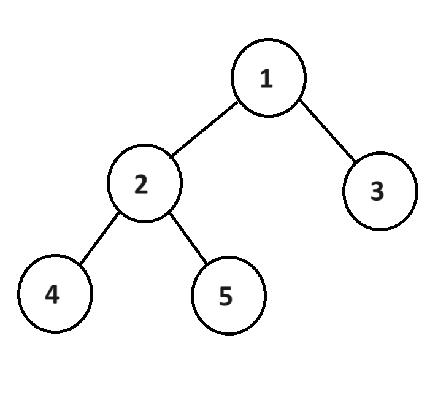
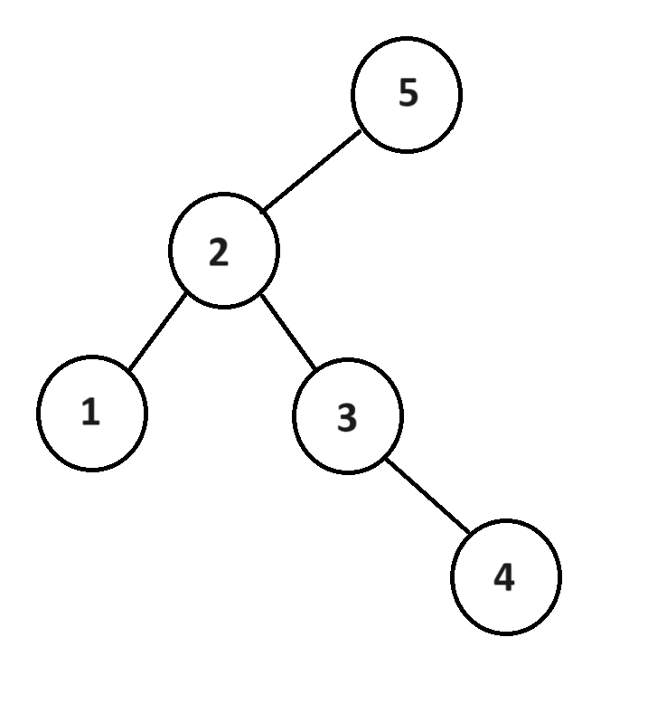
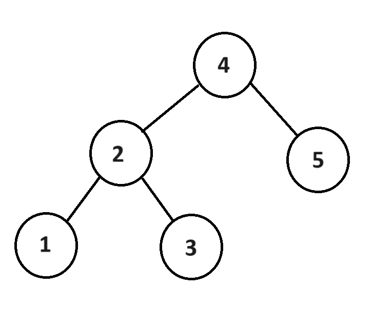
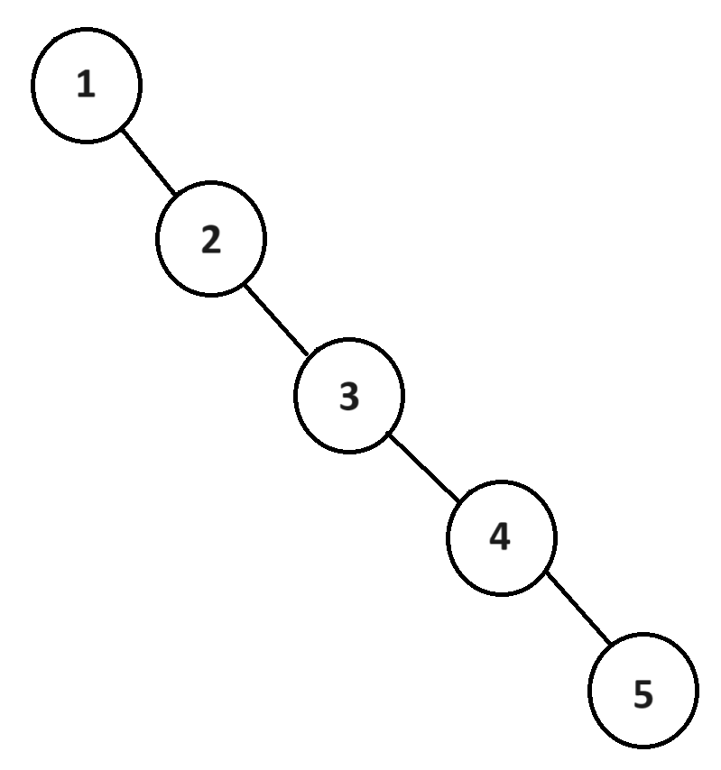

# Stacks

## Introduction
A tree is a useful data structure to organize data in a meaningful way. In this tutorial, we will focus on the group of trees known as binary trees. You will find some of what we learned in the [linked lists tutorial](2-linked_lists.md) is also present here. This is because trees also use the concept of a node. We'll begin with a visual explanation of how a tree works and then move on to how they work in a computer.

## Structure Visualization

### Binary Tree

A binary tree is defined as a tree in which each node may have two children and be associated to one parent. The topmost node is called the root and does not have a parent. The binary tree only points to the root. Each child of a node forms a subtree in which the child is the root. Nodes which have no children are called leafs.

Here is an example of a simple binary tree. There is no order to it so it's not very useful. Node 1 is the root, Node 4, 5, and 3 are leaves.



Another important concept to understand is that of a tree's height. The tree height is defined as the number of nodes from the root to the farthest leaf inclusive. In the above binary tree, the height is three (1, 2, 4) or (1, 2, 5). The height of the left subtree (root 2) is 2 (2, 4) or (2, 5) and the height of the right subtree (root 3) is 1 (3).

### Binary Search Tree

A binary tree becomes useful when there is some order to the data. A binary search tree (BST) has the rule that each node must be greater than all nodes in its left subtree and must be less than all nodes in its right subtree. If multiple nodes of the same value are allowed, then they may exist in either the left or right of the duplicate node.

It is important to recognize that the concept of less, and greater may have a custom definition provided by the client. For example, if a tree was to store lists, the client may define their less and greater based on the size of the list or on the sum of the list if it were a list of numbers. In this tutorial, we will only use integers and define the meaning of less and greater with their typical mathematical definitions.

Here is an example of a binary search tree. Notice how the left subtree is large while the right subtree of the root is nonexistant. We will address this issue with the concept of a balanced binary search tree.



### Balanced Binary Search Tree

A balanced binary search tree (balanced BST) is a BST which maintains a good balance between both the left and right subtrees for every node. This balance is defined by the height of the subtrees. A balancing algorithm will maintain a height difference of less then 2 for all subtrees. Two common implementations of balanced BST's are Red-Black Trees and AVL (Adelson-Velskii and Landis) Trees.

Here is the same data from the previous BST, but represented in a balanced BST.



Although balancing algorithms might add a little extra work to the proces of inserting, it maintains a search speed of O(log n). In fact, if data is added sequentially to an unbalanced BST, it becomes an equivalent to a linked list resulting in a search time of O(n). This slow speed is what a balanced BST avoids.




## Binary Search Tree Implementation

To better understand the concept of a tree, we will consider an implementation of an unbalanced tree in python. Python does not provide a built in tree data structure, but you can find packages online which provide it. For actual projects, you should consider these rather than implementing your own.

A tree uses a node much like a linked list. This node will have different properties: value, left_child, and right_child. A node does not need to track its parent. The tree needs only track the root node and the current size of the tree.

```python
# Credit: This code was created with the assistance of GitHub Copilot.
# Date: 4-10-2024

class BinaryTree:
    """ Binary Tree - implements key operations of the binary tree data structure
    
    Methods
    -------
    insert(value)
        Adds a node to the binary tree with the provided value.
    remove(value)
        Removes a node with the provided value from the binary tree.
    contains(value)
        Returns True if the binary tree contains a node with the provided value. Otherwise, returns False.
    height(node)
        Returns the height of the binary tree with the passed node for a root.
    size()
        Returns the number of nodes in the binary tree.
    empty()
        Returns True if binary tree is empty. Otherwise, returns False.
    __iter__()
        Returns an iterator to traverse the binary tree in order.
    __reversed__()
        Returns an iterator to traverse the binary tree in reverse order.

    Attributes
    ----------
    root : Node
        The root node of the binary tree.
    size : int
        The number of nodes in the binary tree.
    """

    class Node:
        """ Node - represents a node in the binary tree.
        Attributes
        ----------
        value : any
            The value stored in the node.
        left_child : Node
            The left child of the node.
        right_child : Node
            The right child of the node.
        """
        def __init__(self, value):
            self.value = value
            self.left_child = None
            self.right_child = None

    def __init__(self):
        self.root = None
        self._size = 0

    def insert(self, value):
        """Adds a node to the binary tree with the provided value.

        Parameters
        ----------
        value : any
            The value to be added to the binary tree
        """
        # Create a new node with the provided value
        new_node = self.Node(value)
        # If the binary tree is empty, set the new node as the root
        if self.root is None:
            self.root = new_node
            # Increment the size of the binary tree
            self._size += 1
        else:
            # Otherwise, insert the new node into the binary tree using a helper method
            self._insert(self.root, new_node)
    
    def _insert(self, current_node, new_node):
        # If the value of the new node is less than the value of the current node
        if new_node.value < current_node.value:
            # If the left child of the current node is None, set the new node as the left child
            if current_node.left_child is None:
                current_node.left_child = new_node
                self._size += 1
            # Otherwise, recursively insert the new node into the left subtree
            else:
                self._insert(current_node.left_child, new_node)
        # If the value of the new node is greater than the value of the current node
        elif new_node.value > current_node.value:
            # If the right child of the current node is None, set the new node as the right child
            if current_node.right_child is None:
                current_node.right_child = new_node
                self._size += 1
            # Otherwise, recursively insert the new node into the right subtree
            else:
                self._insert(current_node.right_child, new_node)

        # If the value is equal to the current node, we do nothing
                
    def remove(self, value):
        """Removes a node with the provided value from the binary tree.

        Parameters
        ----------
        value : any
            The value to be removed from the binary tree
        """
        # We call a helper method to remove the node with the provided value
        self.root = self._remove(self.root, value)

        

    def _remove(self, current_node, value):
        # If the current node is None, we return None. The value is not found in the binary tree.
        if current_node is None:
            return None
        
        # If the value is less than the value of the current node, we recursively remove the value from the left subtree
        if value < current_node.value:
            current_node.left_child = self._remove(current_node.left_child, value)
        # If the value is greater than the value of the current node, we recursively remove the value from the right subtree
        elif value > current_node.value:
            current_node.right_child = self._remove(current_node.right_child, value)
        # If the value is equal to the value of the current node, we remove the current node
        else:
            # We adjust the size of the binary tree
            self._size -= 1

            # Then do the actual removal
            # If there is a child missing, we can simply return the other child whether it exists or not
            if current_node.left_child is None:
                return current_node.right_child
            elif current_node.right_child is None:
                return current_node.left_child
            # If both children exist, we shift the right child up and set the left child as the left child of the right child
            else:
                current_node.value = current_node.right_child.value
                current_node.right_child = self._remove(current_node.right_child, current_node.value)
                # We must adjust the size since the remove helper method will decrement the size even though the number of nodes is unchanged
                self._size += 1
            
        # Always return the current node if it is not removed
        return current_node

    def contains(self, value):
        """Returns True if the binary tree contains a node with the provided value. Otherwise, returns False.

        Parameters
        ----------
        value : any
            The value to be checked in the binary tree
        """
        # We call a helper method to check if the binary tree contains the value
        return self._contains(self.root, value)
    
    def _contains(self, current_node, value):
        # If the current node is None, the value is not found in the binary tree
        if current_node is None:
            return False
        # If the value is less than the value of the current node, we recursively search in the left subtree
        if value < current_node.value:
            return self._contains(current_node.left_child, value)
        # If the value is greater than the value of the current node, we recursively search in the right subtree
        elif value > current_node.value:
            return self._contains(current_node.right_child, value)
        # If the value is equal to the value of the current node, we have found the value
        else:
            return True
        
    def height(self, node=None):
        """Returns the height of the binary tree with the passed node for a root.

        Parameters
        ----------
        node : Node
            The root node of the binary tree. If not provided, the root of the binary tree is used.
        """
        # If a specific node is not provided, default to the root of the binary tree
        if node is None:
            node = self.root
        # We call a helper method to calculate the height of the binary tree
        return self._height(node)
    
    def _height(self, current_node):
        # If the current node is None, return -1 to offset the height calculation
        if current_node is None:
            return -1
        # Recursively calculate the height of the left and right subtrees
        left_height = self._height(current_node.left_child)
        right_height = self._height(current_node.right_child)
        # Return the maximum height of the left and right subtrees plus 1 for the current node
        return 1 + max(left_height, right_height)
    
    def size(self):
        """Returns the number of nodes in the binary tree."""
        return self._size
                
    def empty(self):
        """Returns True if binary tree is empty. Otherwise, returns False."""
        return self._size == 0
    
    def __iter__(self):
        return self._traverse_in_order(self.root)
    
    def _traverse_in_order(self, current_node):
        if current_node is not None:
            # First yield from the left subtree
            yield from self._traverse_in_order(current_node.left_child)
            # Then yield the value of the current node
            yield current_node.value
            # Finally, yield from the right subtree
            yield from self._traverse_in_order(current_node.right_child)

    def __reversed__(self):
        return self._traverse_reverse_order(self.root)
    
    def _traverse_reverse_order(self, current_node):
        if current_node is not None:
            # First yield from the right subtree
            yield from self._traverse_reverse_order(current_node.right_child)
            # Then yield the value of the current node
            yield current_node.value
            # Finally, yield from the left subtree
            yield from self._traverse_reverse_order(current_node.left_child)
```

## Stack Syntax

| Function         | Description                                                                |
| ---              | ---                                                                        |
| insert(value)    | Adds a value to the tree                                                   |
| remove(value)    | Removes a value from the tree                                              |
| contains(value)  | Returns **True** if the value is in the tree. Otherwise, returns **False** |
| traverse_forward | Supports traversing the tree from least to greatest                        |
| traverse_reverse | Supports traversing the tree from greatest to least                        |
| height(node)     | Returns the height of the subtree with the passed node as root             |
| size()           | Returns the number of values in the tree | len(my_stack_list) == 0         |
| empty()          | Returns **True** if the tree is empty. Otherwise, returns **False**        |

## Common Use Cases

BST are commonly used in applications which must be able to quickly find a result.

## Example Problem

Here is a simple example of testing if a tree contains a value

```python
tree = Tree()
tree.insert(5)
tree.insert(3)
tree.insert(8)

print(tree.contains(3)) # True
```

Click [here](./solutions/tree-example.py) to open a runnable python file.

## Tackle This
Insert the following values in a BST: 1, 2, 3, 4, 5, 6, 7, 8, 9. Do it in the optimal order. Then traverse the list in reverse.

You may use [my Tree class](./solutions/tree.py) for your stack implementation.

[Click here](./solutions/tree-problem.py) to see the solution.

[Return to Homepage](0-welcome.md)
